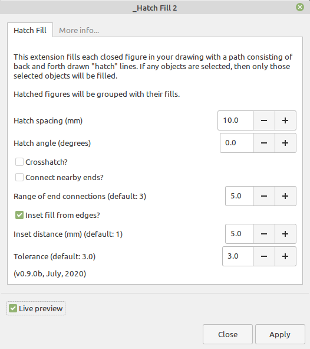
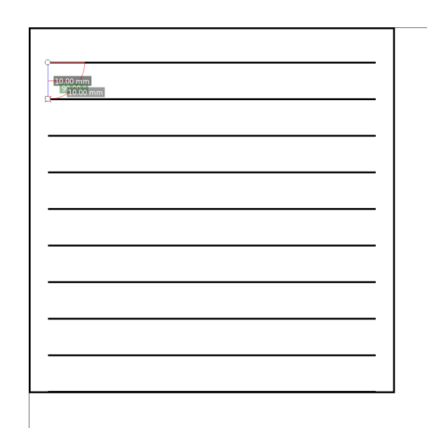
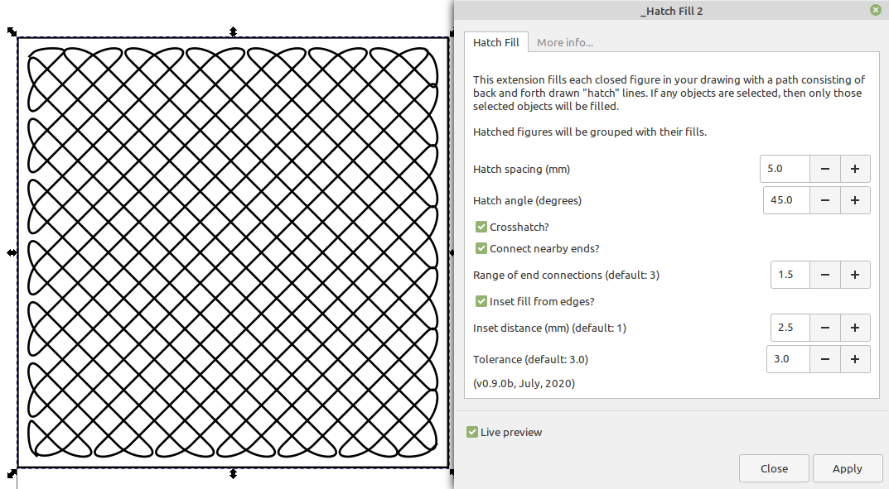
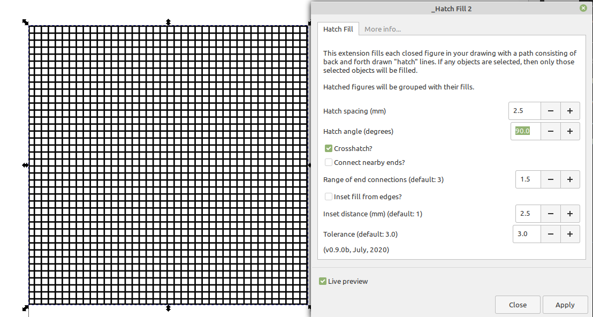
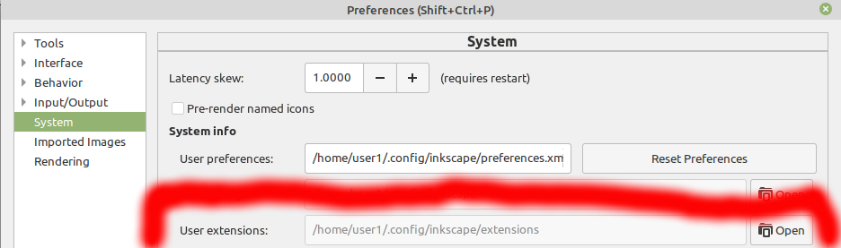

# Inkscape HatchFill2

Inkscape HatchFill2, Forked from [EggBot's HatchFill](https://github.com/evil-mad/EggBot/) & made a "stand-alone" extension (with Inkscape v1.0's ```reldir="inx"```)

# Example

From included ```100x100.svg``` file:







# Installation:

## Generic

1. Download https://github.com/dapperfu/inkscape_HatchFill2/archive/master.zip
2. Extract to Directory in ```Edit > Preferences > System: User``` (Shift-Ctrl-P)
  

### Linux

    mkdir -p ~/.config/inkscape/extensions/
    git clone https://github.com/dapperfu/inkscape_HatchFill2.git ~/.config/inkscape/extensions/inkscape_HatchFill2
    
### MacOS

**TODO**

### Windows

**TODO**

## Usage:

- Launch Inkscape v1.0>
- Extensions > gh:dapperfu > Hatch Fill 2
   - Alt-n + d + h

# Debugging / Development

Uncomment ```inkscape_run_debug()``` at the end of ```hatchfill2.py```.

1. Open "Hatch Fill 2" in Inkscape & Run the extension.
2. A ```debug``` directory will be created in the Hatch Fill 2 extension directory.
   1. ```hatchfill2.debug``` - Summary of how the extension was called
   2. ```hatchfill2.sh``` - Shell script to programmatically run the extension.
   3. ```hatchfill2_run.py``` - Python script to programmatically run the extension.
     (Useful for debugging in Spyder3/VSCode)
   4. ```input_file.svg``` - Copy of the input SVG file.

# Issues 

https://github.com/dapperfu/inkscape_HatchFill2/issues

Tested on Ubuntu 20.04 & ```inkscape``` ```1.0+r73+1~ubuntu20.04.1```
